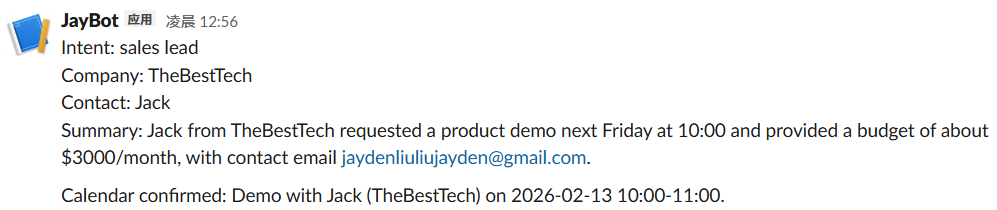

# Voice-Autopilot

[中文 README](README_zh.md)

A **voice-first smart scheduling web app** with an integrated **Sales/Support Autopilot** system.

- **Voice Scheduling**: Speak or type → Whisper STT (voice) → GPT slot extraction (date/time/title) → Playwright automates Google Calendar.
- **Autopilot**: Conversation → OpenAI Tool Calling extraction → RAG retrieval → Reply draft → Actions (Calendar / Slack / Email / Ticket) → Human confirmation → Execute → Audit log.

> **Note:** The original regex/keyword-based NLP parser (`tools/nlp.py`) has been **commented out**. All date/time/title extraction is now handled by OpenAI Tool Calling with the current Toronto datetime injected into the system prompt, enabling natural understanding of relative expressions like "tomorrow", "next Tuesday", "下周三", "后天", etc.

## Environment Setup

### Frontend

`node` v20.19.5

```bash
cd Frontend
npm i
```

### Backend

`Python` 3.10.11

```bash
pip install fastapi uvicorn[standard] python-multipart faster-whisper edge-tts opencc-python-reimplemented dateparser playwright python-dotenv openai jsonschema faiss-cpu numpy httpx pytest pytest-asyncio tzdata
```

Install browser (for Calendar automation):

```bash
python -m playwright install chromium
```

Then move `chrome-win` into `Backend\tools`.

### Configuration

Copy `.env.example` to `.env` at the project root and fill in your keys:

```bash
cp .env.example .env
```

Required:

```env
OPENAI_API_KEY=sk-...
OPENAI_MODEL=gpt-5-mini              # or gpt-4.1-mini, gpt-4o, etc.
OPENAI_EMBEDDING_MODEL=text-embedding-3-small
TIMEZONE=America/Toronto             # default timezone for date resolution
```

Optional (enable specific action connectors):

```env
SLACK_WEBHOOK_URL=https://hooks.slack.com/services/...
LINEAR_API_KEY=lin_api_...
LINEAR_TEAM_ID=
SMTP_HOST=smtp.gmail.com
SMTP_PORT=587
SMTP_USER=your@email.com
SMTP_PASS=your-app-password
SMTP_FROM=noreply@yourdomain.com
SMTP_FROM_NAME=Voice Autopilot
SMTP_SSL=false
SMTP_TIMEOUT=30
```

## Overview

```
Frontend/
  src/
    pages/Home/           # Voice conversation page (voice + text)
    pages/Autopilot/      # Sales/Support Autopilot page
    utils/                # Axios wrapper
    router/               # React Router
    styles/               # Global SCSS variables
    i18n/                 # Bilingual translations (zh/en)
Backend/
  main.py                 # FastAPI entry + dotenv loading
  api/
    autopilot.py          # Autopilot API routes + action enrichment
  chat/
    calendar_extractor.py # GPT-based calendar slot extraction (date/time/title)
    autopilot_extractor.py # OpenAI Tool Calling extraction + repair pass
    reply_drafter.py      # Reply draft generation with citations
    prompt/
      calendar_extraction.txt   # Calendar extraction prompt (with {current_datetime})
      autopilot_extraction.txt  # Autopilot extraction prompt (with {current_datetime})
      autopilot_reply_draft.txt # Reply drafting prompt
  rag/
    ingest.py             # Knowledge base → chunk → embed → FAISS index
    retrieve.py           # FAISS vector search with caching
  connectors/
    slack.py              # Slack Incoming Webhook
    linear.py             # Linear GraphQL issue creation
    email_connector.py    # SMTP email
  actions/
    dispatcher.py         # Unified action routing (dry_run / execute)
  store/
    db.py                 # SQLite init (autopilot.db)
    runs.py               # Audit log CRUD + cache helpers
  business/
    calendar_schema.json  # JSON Schema for calendar slot extraction
    autopilot_schema.json # Strict JSON Schema for autopilot extraction
  utils/
    timezone.py           # Project timezone (default: America/Toronto)
  tools/
    speech.py             # Whisper STT + Edge TTS
    nlp.py                # Regex NLP parser (commented out — replaced by AI)
    calendar_agent.py     # Playwright Google Calendar automation
    file_utils.py         # Temp file helpers
    models.py             # Data models (CalendarCommand, etc.)
  tests/
    test_autopilot.py     # 12 tests (schema, RAG, connectors, SQLite)
knowledge_base/           # Markdown docs for RAG (10 included)
```

### Frontend (React 19 + Vite 7 + AntD 6)

- **Entry**: `main.jsx`
- **Routing**: `App.jsx` + `router/routes.jsx`
- **Home page**: `pages/Home/index.jsx`
- **Autopilot page**: `pages/Autopilot/index.jsx`
- **HTTP wrapper**:
  - `request.js`: axios instance + interceptors + error handling
  - `http.js`: `get/post/put/delete`
  - `api.js`: e.g. `postAPI("/voice", formData)`
- **Vite proxy**: `vite.config.js` (`/api` → `http://localhost:8000`)
- **Global styles**: `src/styles/variables.scss`

### Backend (FastAPI + Whisper + Edge TTS + Playwright + OpenAI)

- **Entry**: `Backend/main.py`
  - FastAPI app + CORS (allows `http://localhost:5173`)
  - Loads `.env` via `python-dotenv`
- **Speech**: `tools/speech.py`
  - Whisper `small`, `device="cpu"`, `compute_type="int8"`
  - OpenCC `t2s` for Traditional → Simplified conversion
  - TTS via `edge_tts` with bilingual voices + fallback
- **Calendar Extraction**: `chat/calendar_extractor.py`
  - GPT Tool Calling with Toronto datetime injection
  - Supports time updates based on context when conflicts occur
  - Replaces the old regex NLP (`tools/nlp.py`, now commented out)
- **Google Calendar Agent**: `tools/calendar_agent.py`
  - Playwright + local Chrome
  - Persistent login via `chrome_profile`
  - Conflict detection
- **Models**: `tools/models.py`

## Run

Frontend:

```bash
cd Frontend
npm run dev
```

Backend:

```bash
cd Backend
python main.py
```

Open: `http://localhost:5173`

## Key Features

### 1. Bilingual Support (Chinese/English)

Across UI, logs, errors, AI extraction, and Autopilot output.

### 2. Voice Scheduling (AI-powered)

- Click **Start Voice Conversation** on the Home page
- Speak or type a scheduling request in Chinese or English
  - Relative dates: "tomorrow", "next Tuesday", "明天", "下周三", "后天"
  - Explicit dates: "Feb 10", "2月10号"
  - Natural times: "2pm to 3pm", "下午两点到三点"
- GPT extracts date/time/title via Tool Calling (current Toronto time injected into prompt)
- System checks conflicts and creates Google Calendar event
- **If a conflict occurs**, you can reply with **voice or text** to adjust the time (you can say only the new time)

### 3. Google Calendar Automation

- Browser automation via Playwright (no API keys needed)
- Persistent login session (first run requires manual Google login + MFA)
- Automatic conflict detection


### 4. Sales/Support Autopilot

Navigate to `http://localhost:5173/autopilot`

#### Example

After analysis:


Meeting in Calendar:


In Slack:



Response Email:


#### Conflict in Calendar

Ask to reschedule:


User selects a new date/time and reschedules:


#### How It Works

**Full pipeline**:

```
Input (text/voice) → Whisper STT → OpenAI Tool Calling (structured extraction)
  → RAG knowledge base retrieval → Reply draft with citations
  → Action Plan → Human confirmation → Execute → Audit log
```

1. **Input**: Paste conversation text or record audio
2. **AI Extraction**: OpenAI extracts intent, urgency, budget, entities, and suggests next-best-actions (strict JSON Schema with repair pass)
3. **Knowledge Base**: RAG retrieves relevant FAQ/product docs as evidence
4. **Reply Draft**: AI generates a professional reply with citations — never fabricates
5. **Action Enrichment**: Payloads are auto-populated from extracted data:
   - `create_meeting` — title from summary, date/time from conversation or defaults
   - `send_slack_summary` — message built from intent + urgency + company + summary
   - `send_email_followup` — only if email address is available; body from reply draft
   - `create_ticket` — title/description from summary, priority from urgency
6. **Confirm & Execute**: Preview all actions, edit payloads, check/uncheck, then confirm

#### Autopilot Enhancements

- **Email follow-up**: If the input contains an email address, the AI reply is formatted as an email (with a noreply notice) and added as a `send_email_followup` action.
- **Rich-text email preview**: The frontend renders the email body as rich text.
- **Reschedule on conflict**: If a calendar action conflicts, you can adjust the time by voice or text and re-run the action.
- **Slack summaries always included**: A `send_slack_summary` action is added by default (even if the model doesn't suggest it), so every run can post a summary to your Slack channel.

#### Autopilot API

| Endpoint | Description |
|---|---|
| `POST /autopilot/run` | Analyze conversation (audio or text). Returns `run_id`, transcript, extracted JSON, evidence, reply draft, action previews. |
| `POST /autopilot/confirm` | Execute confirmed actions. Returns per-action status and results (URLs, summaries). |
| `POST /autopilot/adjust-time` | Adjust a `create_meeting` time using voice or text and return an updated action preview. |
| `POST /autopilot/ingest` | Re-index the knowledge base into the FAISS vector store. |

#### Voice/Calendar API

| Endpoint | Description |
|---|---|
| `POST /voice` | Voice scheduling (audio). Supports `session_id` for conflict rescheduling. |
| `POST /calendar/text` | Text scheduling. Supports `session_id` for conflict rescheduling. |

#### Knowledge Base

Place `.md` files in the `knowledge_base/` directory. 10 sample docs are included covering product overview, pricing, FAQ, support policy, API reference, onboarding, and security.

To (re)index: `POST /autopilot/ingest`

#### Audit Log

All runs are stored in `Backend/autopilot.db` (SQLite) with full traceability: input → transcript → extraction → evidence → draft → actions → execution status → errors.

#### Running Tests

```bash
cd Backend
python -m pytest tests/test_autopilot.py -v
```

12 tests covering: schema validation (3), knowledge base (2), connector dry_run (5), dispatcher (1), SQLite CRUD (1).

## Known Issues & Limitations

- **Manual Google Login**: First run requires manual login + MFA in the browser
- **Playwright Depends on Network**: Slow networks can delay Calendar loading
- **Whisper on CPU**: `small` model can be slow; consider `tiny` for speed
- **Same-Day Events Only**: Cross-day events not yet supported
- **Connector Auth**: Slack/Linear/Email require valid credentials in `.env` to execute (dry_run preview always works)

## Repository

- GitHub: https://github.com/Jayden3422/Voice-Autopilot
