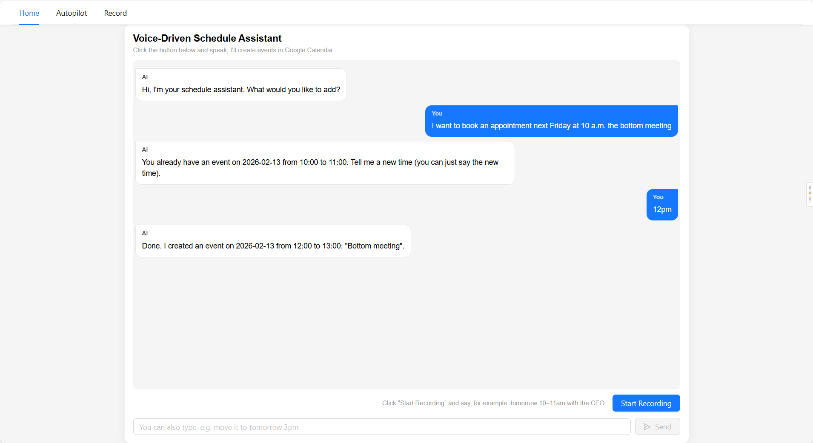
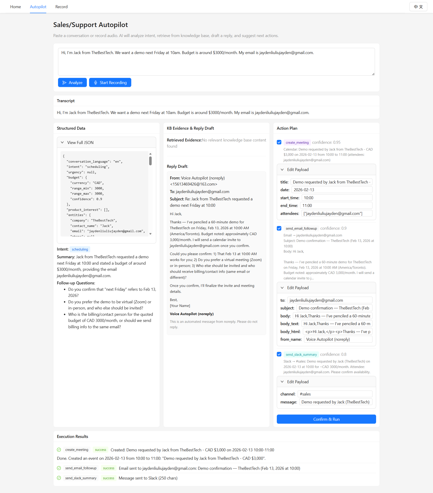
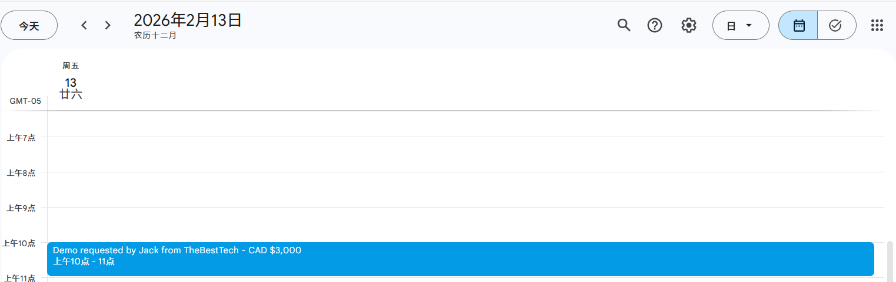
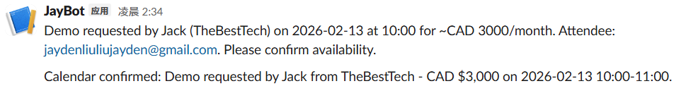
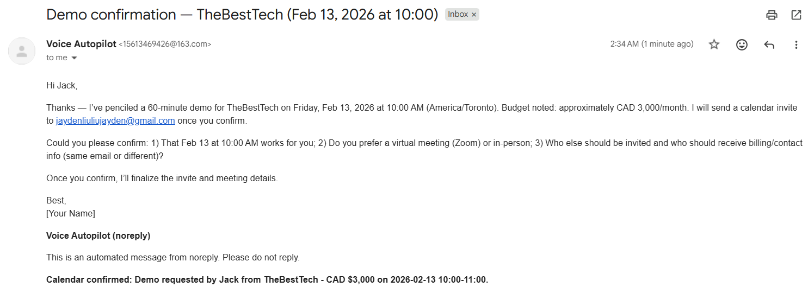
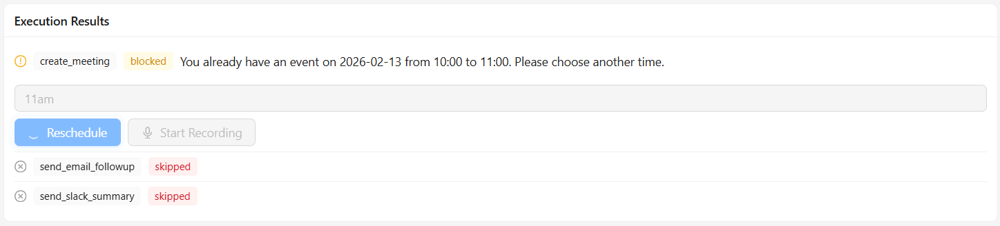
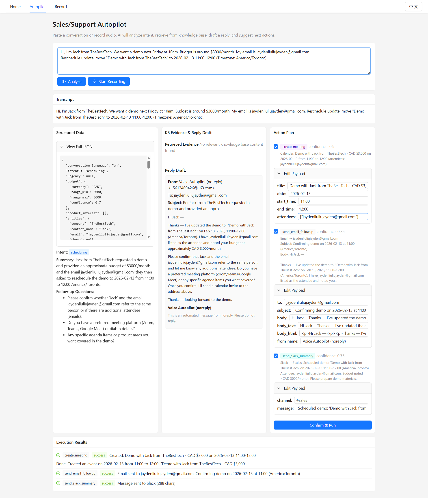
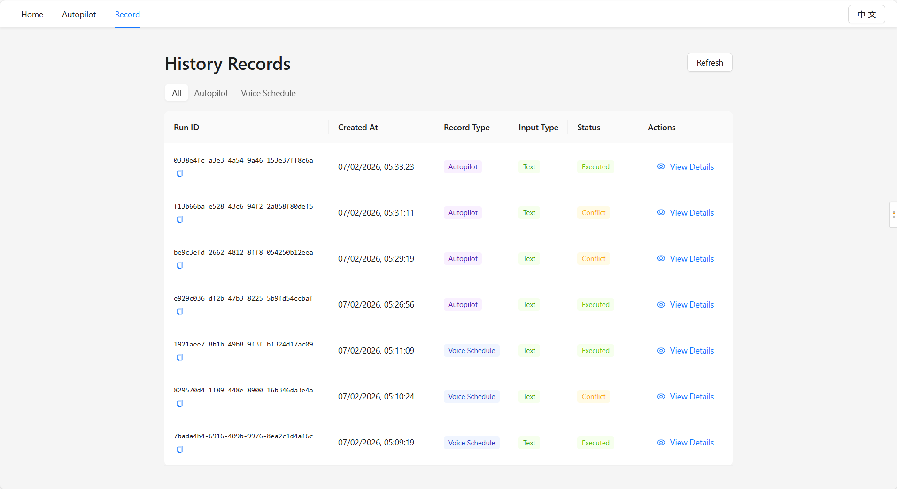
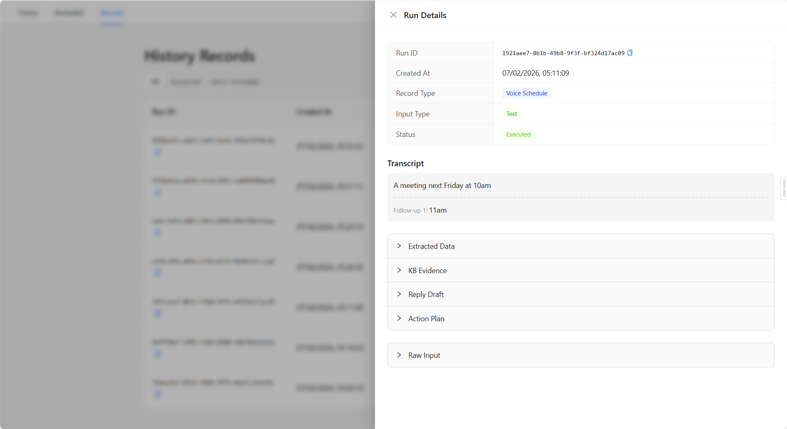
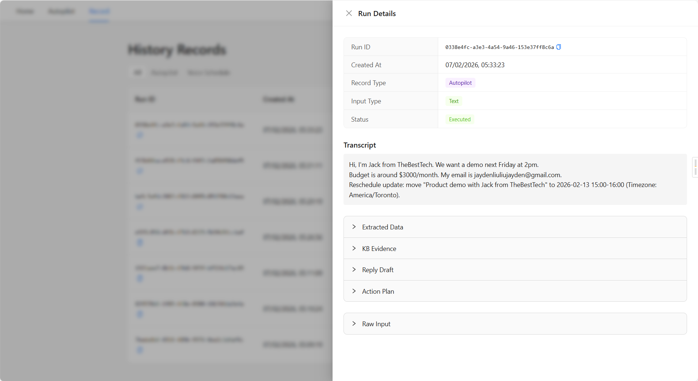

# Voice-Autopilot

[Chinese README](README_zh.md)

<div align="center">

**Production-Grade AI Workflow Automation System**  
*Voice-first scheduling + sales/support autopilot with structured extraction, RAG grounding, and modular action routing*

[](Backend/tests/)
[](https://www.python.org/)
[](https://react.dev/)
[](https://fastapi.tiangolo.com/)

</div>

---

## Table of Contents

- [Core Differentiated Value](#core-differentiated-value)
- [Core Workflows](#core-workflows)
- [Architecture Highlights and Directory](#architecture-highlights-and-directory)
- [Tech Stack and Versions](#tech-stack-and-versions)
- [Quick Demo](#quick-demo)
- [Environment Setup](#environment-setup)
- [Run](#run)
- [MCP Server](#mcp-server)
- [Key Features](#key-features)
- [API Quick Reference](#api-quick-reference)
- [Testing and Quality Assurance](#testing-and-quality-assurance)
- [Known Issues and Limitations](#known-issues-and-limitations)
- [Calendar Integration Deep Dive](#calendar-integration-deep-dive)
- [Code Entry Points](#code-entry-points)
- [Links](#links)

---

<a id="core-differentiated-value"></a>
## Core Differentiated Value

This is not a voice assistant demo. It is an AI workflow system designed for production use.

### Three Core Technical Principles

1. **Schema-Driven Reliability**
   - JSON Schema `oneOf` constrains structured outputs
   - OpenAI Tool Calling generates type-safe payloads
   - Automatic repair pass when validation fails
   - Goal: reduce parsing errors and field ambiguity

2. **Context-Aware Interaction**
   - Prompt injects `{current_datetime}`
   - `context_event` supports partial updates (for example, "move it to 3pm")
   - Multi-turn conversations work without repeatedly restating known context

3. **Production-Ready Extensible Architecture**
   - RAG retrieval with source citations
   - Modular connectors (Calendar/Slack/Email/Linear)
   - End-to-end SQLite audit logging
   - Parallel dry-run preview using `asyncio.gather`

### Business Problem It Solves

Traditional workflows require manual switching between conversations, calendars, Slack, and email.
This system consolidates that into one confirmable and traceable automation pipeline:

```text
Speak or paste a conversation
  ↓
AI structured extraction (intent/budget/entities/time)
  ↓
RAG retrieval from grounding documents
  ↓
Generate citation-backed reply draft
  ↓
Auto-enrich action payloads
  ↓
Human preview and confirmation
  ↓
Parallel execution + audit logging
```

---

<a id="core-workflows"></a>
## Core Workflows

### 1. Voice/Text Scheduling

```text
User: "Schedule a demo next Tuesday at 2pm"
  ↓ Whisper STT (for voice input)
  ↓ GPT Tool Calling + Schema validation
  ↓ Timezone-aware datetime resolution
  ↓ Conflict detection via Playwright
  ↓ Google Calendar automation
```

Conflict handling supports minimal update input: `"Move it to 3pm"`.
On Home, live transcription is shown while recording (browser SpeechRecognition); after stop, audio is uploaded to `/voice` for final recognition and execution.

### 2. Sales/Support Autopilot

```text
Conversation text/audio
  ↓ Strict schema extraction
  ↓ RAG retrieval
  ↓ Citation-backed reply drafting
  ↓ Action enrichment (Meeting/Slack/Email/Ticket)
  ↓ Human confirmation
  ↓ Execute and persist to SQLite
```

Auto-enrichment example: calendar title can include `{company} - {product} - {budget}`.
On Autopilot, `Start Recording` only performs live transcription into the input box; analysis is triggered manually by clicking Analyze.

---

<a id="architecture-highlights-and-directory"></a>
## Architecture Highlights and Directory

### Key Design Decisions

| Component | Design Decision | Benefit |
|------|------|------|
| JSON Schema | Use `oneOf` for each action payload | Type safety, reduced ambiguity |
| Prompt datetime injection | Current time in system prompt | More stable parsing of "tomorrow/next week" |
| Context propagation | `context_event` passthrough | "Only change time" works naturally |
| RAG citations | FAISS + source tracing | Better grounding and verification |
| Routing layer | Unified routing in `actions/dispatcher.py` | Easy connector extension |
| Execution strategy | dry_run + parallel checks | Faster and safer |
| Audit layer | Full lifecycle logging in `store/runs.py` | Observable and traceable |
| Calendar automation | Playwright (browser) **or** Google Calendar API v3 — switchable in Settings UI | No OAuth setup needed for Playwright; API mode supports programmatic integration |
| Settings UI | In-app page for connector on/off and credentials | No need to edit `.env` for connector changes; tokens stored in `settings.json` |
| Startup warmup pool | Background pre-init: Whisper JIT, Piper ONNX (representative-length sentences), OpenAI HTTPS pool, FAISS index | Eliminates first-request latency; ONNX execution plan is primed for real segment sizes |

### Project Structure

```text
Voice-Autopilot/
├── Frontend/
│   └── src/
│       ├── pages/               # Home / Autopilot / Record / Settings
│       ├── hooks/               # useAudioRecorder, useAudioPlayback, useSpeechRecognition
│       ├── config/              # TTS and feature config
│       ├── i18n/                # zh/en translations
│       ├── utils/               # Axios wrapper
│       └── router/              # route config
├── Backend/
│   ├── main.py                  # FastAPI entry point
│   ├── api/                     # Routers: autopilot, voice, settings + Pydantic models
│   ├── extraction/              # GPT extraction and reply drafting
│   │   └── prompt/              # system prompt templates (.txt)
│   ├── actions/                 # Business logic: dispatcher, enrichment, calendar helpers
│   ├── connectors/              # Slack / Email / Linear / Calendar (Playwright + API)
│   ├── rag/                     # FAISS indexing + retrieval
│   ├── speech/                  # Whisper STT + Piper TTS
│   ├── store/                   # SQLite (db, runs CRUD) + settings persistence + FastAPI deps
│   ├── ai_client/               # OpenAI client factory (lru_cache singleton)
│   ├── utils/                   # lang, timezone, file_utils, warmup pool
│   ├── schemas/                 # autopilot_schema.json / calendar_schema.json
│   ├── mcp/                     # MCP server and test client
│   ├── tests/                   # 75 pytest tests across 5 files
│   ├── models/piper/            # Piper TTS voice models (zh_CN-xiao_ya / en_US-amy)
│   ├── rag_store/               # built FAISS index + embedding cache (runtime)
│   ├── settings.json            # Runtime settings (auto-created; connector keys + calendar mode)
│   └── chrome_profile/          # Playwright persistent browser session
├── knowledge_base/              # RAG docs (10 .md files)
├── requirements.txt
├── .env.example
└── README.md / README_zh.md
```

---

<a id="tech-stack-and-versions"></a>
## Tech Stack and Versions

### Frontend

| Tech | Version | Purpose |
|------|------|------|
| React | 19.0.0 | Frontend framework |
| Vite | 7.0.3 | Build and development |
| Ant Design | 6.x | UI components |
| Axios | ^1.7.9 | HTTP client |
| React Router | ^7.1.3 | Routing |
| SCSS | - | Style preprocessing |

### Backend

| Tech | Version | Purpose |
|------|------|------|
| FastAPI | ^0.136.3 | Web API |
| Uvicorn | ^0.49.0 | ASGI server |
| OpenAI | ^1.59.7 | Tool Calling / Embeddings |
| faster-whisper | ^1.1.0 | Speech recognition |
| piper-tts | ^1.4.1 | Speech synthesis (local, offline) |
| Playwright | ^1.50.1 | Google Calendar automation (browser mode) |
| google-api-python-client | ^2.x | Google Calendar API v3 (API mode) |
| google-auth-oauthlib | ^1.x | OAuth2 flow for Google Calendar API |
| FAISS (CPU) | - | Vector retrieval |
| MCP SDK | ^1.26.0 | Model Context Protocol server |
| jsonschema | ^4.23.0 | Output validation |
| pytest | ^9.0.2 | Test framework |

---

<a id="quick-demo"></a>
## Quick Demo

### Example: Autopilot

Input:

```text
Hi, I'm Jack from TheBestTech. We want to schedule a demo next Friday at 10am.
Budget is around $3000/month. My email is jack@example.com.
```

Extraction result (example):

```json
{
  "intent": "sales_lead",
  "urgency": "medium",
  "budget": {"currency": "CAD", "range_min": 3000, "range_max": 3000},
  "entities": {"company": "TheBestTech", "contact_name": "Jack", "email": "jack@example.com"},
  "next_best_actions": [
    {"action_type": "create_meeting", "payload": {"date": "2026-02-14", "start_time": "10:00", "end_time": "11:00", "title": "Demo"}},
    {"action_type": "send_slack_summary", "payload": {"channel": "#sales", "message": "..."}},
    {"action_type": "send_email_followup", "payload": {"to": "jack@example.com", "subject": "...", "body": "..."}}
  ]
}
```

Result: create meeting, send Slack summary, send follow-up email, and persist full run to SQLite.  
Note: all actions require human confirmation before execution (`dry_run` preview -> edit -> confirm).

---

<a id="environment-setup"></a>
## Environment Setup

### Frontend

`node` v20.19.5

```bash
cd Frontend
npm i
```

### Backend

`Python` 3.10.11

Create and activate a virtual environment:

```bash
# Windows
python -m venv .venv
.\.venv\Scripts\activate

# macOS / Linux
python -m venv .venv
source .venv/bin/activate
```

Install all dependencies:

```bash
pip install -r requirements.txt
```

Install PyTorch (CPU-only, required for Chinese TTS phonemization):

```bash
pip install torch --index-url https://download.pytorch.org/whl/cpu
```

> **Windows note:** `g2pw` (installed via `requirements.txt`) opens Chinese character files without an explicit encoding, which defaults to `cp1252` on Windows and causes a crash on first Chinese TTS synthesis. Start the backend with Python's UTF-8 mode flag to fix it — see the [Run](#run) section.

Download Piper TTS voice models (run once):

```bash
mkdir -p Backend/models/piper
curl -L "https://huggingface.co/rhasspy/piper-voices/resolve/main/zh/zh_CN/xiao_ya/medium/zh_CN-xiao_ya-medium.onnx" -o Backend/models/piper/zh_CN-xiao_ya-medium.onnx
curl -L "https://huggingface.co/rhasspy/piper-voices/resolve/main/zh/zh_CN/xiao_ya/medium/zh_CN-xiao_ya-medium.onnx.json" -o Backend/models/piper/zh_CN-xiao_ya-medium.onnx.json
curl -L "https://huggingface.co/rhasspy/piper-voices/resolve/main/en/en_US/amy/medium/en_US-amy-medium.onnx" -o Backend/models/piper/en_US-amy-medium.onnx
curl -L "https://huggingface.co/rhasspy/piper-voices/resolve/main/en/en_US/amy/medium/en_US-amy-medium.onnx.json" -o Backend/models/piper/en_US-amy-medium.onnx.json
```

Install browser runtime (required for Calendar automation in Playwright mode):

```bash
python -m playwright install chromium
```

Copy `.env.example` to `.env` at project root:

```bash
cp .env.example .env
```

Required:

```env
OPENAI_API_KEY=sk-...
OPENAI_MODEL=gpt-4.1-mini
OPENAI_EMBEDDING_MODEL=text-embedding-3-small
TIMEZONE=America/Toronto
```

Optional (to enable connectors via `.env`):

```env
SLACK_WEBHOOK_URL=https://hooks.slack.com/services/...
LINEAR_API_KEY=lin_api_...
LINEAR_TEAM_ID=
SMTP_HOST=smtp.gmail.com
SMTP_PORT=587
SMTP_USER=your@email.com
SMTP_PASS=your-app-password
SMTP_FROM=noreply@yourdomain.com
SMTP_FROM_NAME=Voice Autopilot
SMTP_SSL=false
SMTP_TIMEOUT=30
```

> **Tip:** Connector credentials and the calendar mode can also be configured at runtime through the in-app **Settings** page (`/settings`) without editing `.env`. Values saved in the UI are stored in `Backend/settings.json` and take precedence over environment variables.

Note: Piper model paths (`PIPER_ZH_MODEL`, `PIPER_EN_MODEL`) and streaming STT/TTS tuning variables (for example `STREAM_STT_*`, `TTS_SEGMENT_*`) are available in `.env.example`.

---

<a id="run"></a>
## Run

```bash
cd Frontend
npm run dev
```

```bash
cd Backend
python -X utf8 main.py
```

> **`-X utf8`** enables Python's UTF-8 mode, required on Windows for Chinese TTS (`g2pw` reads character files without an explicit encoding). Safe to use on all platforms; no effect on macOS/Linux where UTF-8 is already the default.

On startup the warmup pool runs in the background and pre-initializes all heavy components:

| Component | What is primed | Typical cost |
|---|---|---|
| `whisper_stt` | CTranslate2 JIT kernels (1 s silence inference) | ~2–5 s |
| `piper_tts_zh` | ONNX execution plan + g2pW BERT model (~16-char sentence) | ~5–15 s |
| `piper_tts_en` | ONNX execution plan (~16-char sentence) | ~1–3 s |
| `openai_api` | httpx connection pool + both client singletons | ~0.5–1 s |
| `rag_faiss` | FAISS index loaded into memory (skipped if not built) | ~1–3 s |

The server accepts requests immediately; a full log summary is printed when all tasks finish.

Build the knowledge base index (required for RAG search, only needed once; re-run after updating `knowledge_base/*.md`):

```bash
curl -X POST http://localhost:8888/ingest
```

Open: `http://localhost:5173`

---

<a id="mcp-server"></a>
## MCP Server

The project exposes all core capabilities as an [MCP (Model Context Protocol)](https://modelcontextprotocol.io/) server, allowing Claude Desktop, Claude Code, or any MCP-compatible client to call them directly.

### Available Tools

| Tool | Description |
|------|-------------|
| `analyze_transcript` | Extract structured data (intent, entities, actions) from a conversation transcript |
| `search_knowledge_base` | Semantic search over the FAISS-indexed knowledge base |
| `send_slack_message` | Send a message to Slack via webhook |
| `send_email` | Send an email via SMTP |
| `create_linear_ticket` | Create an issue in Linear |
| `create_calendar_event` | Create a Google Calendar event via Playwright |
| `draft_reply` | Generate an AI-powered reply draft with citations |
| `list_runs` | Query autopilot run history |

### Resources

| URI | Content |
|-----|---------|
| `autopilot://schema` | The JSON extraction schema |
| `autopilot://knowledge-base` | List of knowledge base documents |

### Setup for Claude Desktop

Add to `claude_desktop_config.json` (Windows: `%APPDATA%\Claude\claude_desktop_config.json`):

```json
{
  "mcpServers": {
    "voice-autopilot": {
      "command": "D:\\Projects\\Voice-Autopilot\\.venv\\Scripts\\python.exe",
      "args": ["D:\\Projects\\Voice-Autopilot\\Backend\\mcp\\mcp_server.py"],
      "env": {
        "PYTHONPATH": "D:\\Projects\\Voice-Autopilot\\Backend"
      }
    }
  }
}
```

### Testing

```bash
# Interactive inspector
mcp dev Backend/mcp/mcp_server.py

# Automated test client (10 tests)
python Backend/mcp/test_mcp_client.py

# Test a specific tool
python Backend/mcp/test_mcp_client.py search_knowledge_base
```

Note: the HTTP server starts immediately; the startup warmup pool pre-initializes FAISS and other components in the background (~60s on first run). Subsequent tool calls are instant.

---

<a id="key-features"></a>
## Key Features

### 1. Bilingual Support

Covers UI, logs, errors, AI extraction, and autopilot output in Chinese and English.

### 2. Voice/Text Scheduling (AI-Driven)

- Supports natural date/time expressions in both Chinese and English (for example: "tomorrow", "next Tuesday", "2pm to 3pm")
- Home shows live transcript while recording, then runs backend recognition/scheduling after stop
- Tool Calling extracts calendar slots with schema validation
- Automatic conflict detection
- Voice or text rescheduling on conflicts



### 3. Sales/Support Autopilot

Page: `/autopilot`

- Accepts text or audio, then extracts intent/urgency/budget/entities
- Main recording button performs live transcription into the input box only (no auto-run)
- Retrieves RAG evidence and drafts citation-backed replies
- Auto-populates action payloads with human-edit controls
- Includes `send_slack_summary` by default
- Adds `send_email_followup` when an email is detected
- Supports conflict rescheduling via `adjust-time`



Meeting in calendar:


In Slack:


Response email:


Calendar conflict and reschedule:



### 4. Settings Page

Page: `/settings` — configure connectors and calendar mode without touching `.env`.

| Section | What you can do |
|---------|-----------------|
| **Slack** | Toggle on/off; set Incoming Webhook URL |
| **Email (SMTP)** | Toggle on/off; set host, port, credentials, SSL |
| **Linear** | Toggle on/off; set API key and Team ID |
| **Calendar mode** | Switch between **Playwright** (browser automation, default) and **Google Calendar API** (OAuth2) |
| **Google Calendar API** | Enter Client ID + Client Secret → click **Connect** → OAuth2 in new tab → tokens saved automatically |

Settings are stored in `Backend/settings.json` and override corresponding `.env` values. Sensitive fields are masked in the UI.

**Google Calendar API one-time setup:**

1. Open [Google Cloud Console](https://console.cloud.google.com/) → APIs & Services → Credentials
2. Create an **OAuth 2.0 Client ID** (type: **Web application**)
3. Add authorized redirect URI: `http://localhost:8888/settings/google-calendar/callback`
4. Enter the Client ID and Client Secret in the Settings page → **Save** → **Connect Google Calendar**

### 5. History Record

Page: `/record`, with type filtering, detail view, and failed-action retry.





---

<a id="api-quick-reference"></a>
## API Quick Reference

| Endpoint | Method | Description |
|------|------|------|
| `/voice` | POST | Voice scheduling (supports `session_id` for conflict rescheduling) |
| `/voice/ws` | WebSocket | Streaming voice channel (`stt_partial/stt_final` and chunked TTS events) |
| `/calendar/text` | POST | Text scheduling (supports `session_id` for conflict rescheduling) |
| `/autopilot/run` | POST | Analyze conversation and return action preview |
| `/autopilot/confirm` | POST | Execute confirmed actions |
| `/autopilot/adjust-time` | POST | Adjust conflicting meeting time and return updated preview |
| `/autopilot/retry/{run_id}` | POST | Retry failed actions |
| `/autopilot/runs` | GET | Run history list (pagination/filtering) |
| `/autopilot/runs/{run_id}` | GET | Single run details |
| `/autopilot/ingest` | POST | Re-index knowledge base |
| `/settings` | GET | Return current settings (sensitive fields masked) |
| `/settings` | PUT | Save settings (preserves existing secrets when `***` sent) |
| `/settings/google-calendar/auth-url` | GET | Generate Google OAuth2 authorization URL |
| `/settings/google-calendar/callback` | GET | OAuth2 redirect handler (stores tokens, redirects to frontend) |
| `/settings/google-calendar/status` | GET | Check Google Calendar connection status |
| `/settings/google-calendar/disconnect` | POST | Clear stored Google tokens |

---

<a id="testing-and-quality-assurance"></a>
## Testing and Quality Assurance

### Testing Strategy

Tests are written at the cheapest reliable layer: pure logic as unit tests, service logic as focused integration tests, external boundaries mocked only where necessary. See [Test_Design_Philosophy.md](Test_Design_Philosophy.md).

### Backend — 75 tests (~4 s)

```bash
cd Backend
python -m pytest tests/ -v
```

| File | Count | What it covers |
|------|-------|----------------|
| `test_autopilot.py` | 12 | Schema validation, RAG chunking, connector dry-runs, dispatcher routing, SQLite CRUD |
| `test_lang.py` | 8 | `normalize_lang` — all locale variants and fallback defaults |
| `test_calendar.py` | 22 | `resolve_date/time`, `enrich_calendar_title`, `prepare_payload_for_preview`, `finalize_payload`, `build_confirmation` |
| `test_enrichment.py` | 22 | `build_rag_query`, `enrich_actions` (slack/email injection, urgency→priority), `append_confirmation_*`, `merge_extracted_actions`, `determine_final_status` |
| `test_settings_api.py` | 11 | `_mask` (sensitive fields, empty values, no mutation) and `_merge_preserving_masked` (preserves secrets when `***` is sent) |

### Frontend — 37 tests (Vitest + React Testing Library)

```bash
cd Frontend
npm test
```

| File | Count | What it covers |
|------|-------|----------------|
| `translations.test.js` | 28 | All required UI keys present in both `en` and `zh`; both languages have identical top-level sections |
| `api.test.js` | 5 | `getAPI/postAPI/putAPI/deleteListAPI` delegate correct HTTP method and forward config |
| `useAudioRecorder.test.jsx` | 5 | Recording state machine: initial state, start, stop, `send=false` guard, cleanup — all browser APIs stubbed |

Recommended CI: `GitHub Actions` running both `pytest` and `npm test`.

---

<a id="known-issues-and-limitations"></a>
## Known Issues and Limitations

- First-time Google Calendar use requires manual login + MFA
- Playwright is sensitive to network quality
- Whisper `small` can be slow on CPU (consider `tiny` for speed)
- Current implementation supports same-day events only
- Piper TTS cold-start: ONNX Runtime caches execution plans per input shape; the warmup pool synthesizes representative-length sentences (matching `TTS_FIRST_SEGMENT_CHARS`) so the cached plan aligns with real requests — first real call is fast after warmup completes
- Piper Chinese TTS requires `torch` (CPU-only, ~125 MB), `g2pw`, `unicode_rbnf`, and `sentence_stream` (all in `requirements.txt` except `torch`). On Windows, start with `python -X utf8 main.py` to prevent a `cp1252` encoding error in `g2pw`.

---

<a id="calendar-integration-deep-dive"></a>
## Calendar Integration Deep Dive

The calendar mode can be switched at runtime on the **Settings** page without restarting the server.

### Mode 1 — Playwright (Browser Automation, Default)

Compared with OAuth-heavy Calendar API integration, this approach is faster to operationalize:
- No OAuth client configuration
- Reuses real user login state + MFA
- Persistent sessions reduce repeated login overhead

**Implementation Highlights:**

1. **Persistent context**: `launch_persistent_context` + `Backend/chrome_profile/`.
2. **Login detection**: URL + core DOM signals.
3. **Selector strategy**: prioritize `role/aria-label`, then data attributes, then CSS fallback.
4. **Conflict detection**: parse `data-eventchip` time ranges and detect overlap.
5. **Form fill automation**: open modal via `c` shortcut and fill by bilingual label matching.
6. **Error handling**: layered handling for timeout, Playwright errors, and generic fallback.

**Production Notes:**

- Prefer semantic selectors to reduce breakage after UI updates
- Save failure screenshots and integrate alerting
- Consider context pooling and rate limiting for high concurrency
- Protect `chrome_profile` (contains sensitive session credentials)

### Mode 2 — Google Calendar API v3 (OAuth2)

Uses the official Google Calendar API instead of browser automation. Suitable when programmatic access is preferred or when Playwright session management is impractical.

**How it works:**

1. User enters Client ID + Client Secret on the Settings page and saves.
2. Clicks **Connect Google Calendar** → backend generates an OAuth2 authorization URL.
3. User grants permissions in a new tab; Google redirects to the backend callback.
4. Backend exchanges the code for tokens and stores them in `Backend/settings.json`.
5. On every calendar action the access token is refreshed automatically if expired.

**Conflict detection** uses `events.list()` with `timeMin`/`timeMax` — no browser required.

**Implementation entry point:** `Backend/connectors/google_calendar_api.py`

---

<a id="code-entry-points"></a>
## Code Entry Points

- Orchestration: `Backend/api/autopilot.py`
- Settings API + OAuth2 flow: `Backend/api/settings.py`
- Settings persistence: `Backend/store/settings_store.py`
- Structured extraction: `Backend/extraction/autopilot_extractor.py`
- Calendar slot extraction: `Backend/extraction/calendar_extractor.py`
- Reply drafting: `Backend/extraction/reply_drafter.py`
- Schema definitions: `Backend/schemas/autopilot_schema.json`
- Calendar automation (Playwright): `Backend/connectors/calendar_agent.py`
- Calendar automation (API): `Backend/connectors/google_calendar_api.py`
- Action routing: `Backend/actions/dispatcher.py`
- Action enrichment: `Backend/actions/enrichment.py`
- Calendar payload helpers: `Backend/actions/calendar.py`
- RAG: `Backend/rag/ingest.py`, `Backend/rag/retrieve.py`
- Speech (STT + TTS): `Backend/speech/speech.py`
- Audit logs: `Backend/store/db.py`, `Backend/store/runs.py`
- Startup warmup pool: `Backend/utils/warmup/`
- MCP Server: `Backend/mcp/mcp_server.py`
- MCP test client: `Backend/mcp/test_mcp_client.py`
- Tests: `Backend/tests/`

---

<a id="links"></a>
## Links

- GitHub: https://github.com/Jayden3422/Voice-Autopilot
- Chinese Docs: [README_zh.md](README_zh.md)
