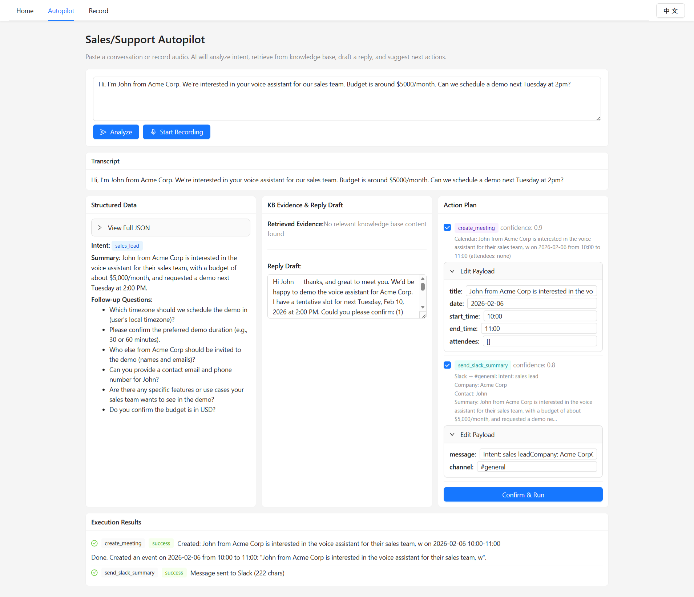
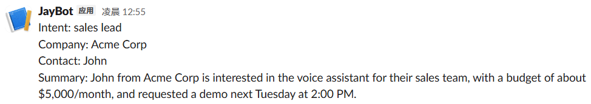

# voice-assistant

[English README](README.md)

一个 **语音驱动的智能日程 Web 应用**，集成 **销售/支持自动驾驶（Autopilot）** 系统。

- **语音日程**：说话 → Whisper STT → NLP → Playwright 自动化 Google Calendar。
- **Autopilot**：对话 → OpenAI Tool Calling 结构化提取 → RAG 知识库检索 → 回复草稿 → 动作（日历 / Slack / 邮件 / 工单） → 人工确认 → 执行 → 审计日志。

## 环境配置

### 前端

`node` v20.19.5

```bash
cd Frontend
npm i
```

### 后端

`Python` 3.10.11

```bash
pip install fastapi uvicorn[standard] python-multipart faster-whisper edge-tts opencc-python-reimplemented dateparser playwright python-dotenv openai jsonschema faiss-cpu numpy httpx pytest pytest-asyncio
```

安装浏览器（用于日历自动化）：

```bash
python -m playwright install chromium
```

之后移动 `chrome-win` 到 `Backend\tools` 文件夹。

### 配置

将项目根目录下的 `.env.example` 复制为 `.env` 并填入你的密钥：

```bash
cp .env.example .env
```

必填项：

```env
OPENAI_API_KEY=sk-...
OPENAI_MODEL=gpt-5-mini              # 或 gpt-4.1-mini、gpt-4o 等
OPENAI_EMBEDDING_MODEL=text-embedding-3-small
```

可选项（启用对应的动作连接器）：

```env
SLACK_WEBHOOK_URL=https://hooks.slack.com/services/...
LINEAR_API_KEY=lin_api_...
LINEAR_TEAM_ID=
SMTP_HOST=smtp.gmail.com
SMTP_PORT=587
SMTP_USER=your@email.com
SMTP_PASS=your-app-password
```

## 总览

```
Frontend/
  src/
    pages/Home/           # 语音对话页面
    pages/Autopilot/      # 销售/支持 Autopilot 页面
    utils/                # Axios 封装
    router/               # React Router
    styles/               # 全局 SCSS 变量
    i18n/                 # 中英双语翻译
Backend/
  main.py                 # FastAPI 入口 + dotenv 加载
  api/
    autopilot.py          # Autopilot API 路由 + 动作数据补全
  chat/
    autopilot_extractor.py # OpenAI Tool Calling 提取 + 修复重试
    reply_drafter.py      # 带引用的回复草稿生成
    prompt/               # 提取与生成的 system prompt
  rag/
    ingest.py             # 知识库 → 分块 → 嵌入 → FAISS 索引
    retrieve.py           # FAISS 向量检索（带缓存）
  connectors/
    slack.py              # Slack Incoming Webhook
    linear.py             # Linear GraphQL 工单创建
    email_connector.py    # SMTP 邮件发送
  actions/
    dispatcher.py         # 统一动作路由（dry_run / execute）
  store/
    db.py                 # SQLite 初始化（autopilot.db）
    runs.py               # 审计日志 CRUD + 缓存
  business/
    autopilot_schema.json # 严格 JSON Schema（提取输出结构）
  tools/
    speech.py             # Whisper STT + Edge TTS
    nlp.py                # NLP 日期/时间解析（中英文）
    calendar_agent.py     # Playwright Google Calendar 自动化
    file_utils.py         # 临时文件工具
    models.py             # 数据模型（CalendarCommand 等）
  tests/
    test_autopilot.py     # 12 个测试（schema、RAG、连接器、SQLite）
knowledge_base/           # RAG 用 Markdown 文档（含 10 篇示例）
```

### 前端（React 19 + Vite 7 + AntD 6）

- **入口**：`main.jsx`
- **路由**：`App.jsx` + `router/routes.jsx`
- **Home 页面**：`pages/Home/index.jsx`
- **Autopilot 页面**：`pages/Autopilot/index.jsx`
- **HTTP 封装**：
  - `request.js`：axios 实例 + 拦截器 + 错误处理
  - `http.js`：封装 `get/post/put/delete`
  - `api.js`：如 `postAPI("/voice", formData)`
- **Vite 代理**：`vite.config.js`（`/api` → `http://localhost:8000`）
- **全局样式变量**：`src/styles/variables.scss`

### 后端（FastAPI + Whisper + Edge TTS + Playwright + OpenAI）

- **入口**：`Backend/main.py`
  - FastAPI 应用 + CORS（允许 `http://localhost:5173`）
  - 通过 `python-dotenv` 加载 `.env`
- **语音模块**：`tools/speech.py`
  - Whisper `small`，`device="cpu"`，`compute_type="int8"`
  - OpenCC `t2s` 简繁转换
  - TTS 使用 `edge_tts`，中英音色 + 自动 fallback
- **NLP 解析**：`tools/nlp.py`
  - 中英文日期/时间解析
- **Google Calendar Agent**：`tools/calendar_agent.py`
  - Playwright + 本地 Chrome
  - `chrome_profile` 持久化登录态
  - 冲突检测
- **数据模型**：`tools/models.py`

## 运行

前端：

```bash
cd Frontend
npm run dev
```

后端：

```bash
cd Backend
python main.py
```

打开：`http://localhost:5173`

## 核心功能

### 1. 中英双语支持

覆盖 UI、日志、报错、NLP 解析、Autopilot 输出。

### 2. 语音日程

- 在 Home 页面点击 **开始语音对话**
- 说出日程请求（如"明天上午十点到十一点和 CEO 开会"）
- 系统解析、检测冲突、创建 Google Calendar 事件


### 3. Google Calendar 自动化

- 基于 Playwright 的浏览器自动化（无需 API 密钥）
- 持久化登录（首次运行需手动登录 Google + MFA）
- 自动冲突检测

### 4. 销售/支持 Autopilot

访问 `http://localhost:5173/autopilot`



在`Slack`中：

 

**完整管线**：

```
输入（文本/语音） → Whisper STT → OpenAI Tool Calling（结构化提取）
  → RAG 知识库检索 → 带引用的回复草稿
  → 动作计划 → 人工确认 → 执行 → 审计日志
```

#### 工作原理

1. **输入**：粘贴对话文本或录制音频
2. **AI 提取**：OpenAI 提取意图、紧急程度、预算、实体信息，并建议下一步动作（严格 JSON Schema + 修复重试）
3. **知识库**：RAG 检索相关 FAQ / 产品文档作为依据
4. **回复草稿**：AI 生成专业回复（带引用）——不会编造内容
5. **动作数据补全**：从提取数据中自动填充 Payload：
   - `create_meeting` — 标题取自摘要，日期/时间取自对话内容或使用默认值
   - `send_slack_summary` — 从意图 + 紧急程度 + 公司 + 摘要构建消息
   - `send_email_followup` — 仅在有邮箱地址时生成；正文取自回复草稿
   - `create_ticket` — 标题/描述取自摘要，优先级取自紧急程度
6. **确认并执行**：预览所有动作，编辑 Payload，勾选/取消，然后确认

#### Autopilot API

| 端点 | 说明 |
|---|---|
| `POST /autopilot/run` | 分析对话（音频或文本）。返回 `run_id`、转录文本、提取 JSON、证据、回复草稿、动作预览。 |
| `POST /autopilot/confirm` | 执行已确认的动作。返回每个动作的状态和结果（URL、摘要）。 |
| `POST /autopilot/ingest` | 重新索引知识库到 FAISS 向量存储。 |

**请求示例**（`/autopilot/run`）：

```json
{
  "mode": "text",
  "text": "Hi, I'm John from Acme Corp. We need your voice assistant for our sales team. Budget is around $5000/month. Can we schedule a demo next Tuesday at 2pm?",
  "locale": "en"
}
```

**响应示例**（节选）：

```json
{
  "run_id": "a1b2c3d4-...",
  "transcript": "Hi, I'm John from Acme Corp...",
  "extracted": {
    "intent": "sales_lead",
    "urgency": "medium",
    "budget": { "currency": "USD", "range_min": 5000, "range_max": 5000, "confidence": 0.9 },
    "entities": { "company": "Acme Corp", "contact_name": "John" },
    "summary": "Sales lead from Acme Corp requesting demo, $5K/mo budget.",
    "next_best_actions": [
      { "action_type": "create_meeting", "confidence": 0.95, "payload": { "title": "Demo with Acme Corp", "date": "2026-02-10", "start_time": "14:00", "end_time": "15:00" } },
      { "action_type": "send_slack_summary", "confidence": 0.85, "payload": { "message": "Intent: sales lead\nCompany: Acme Corp\n..." } }
    ]
  },
  "evidence": [{ "doc": "02_pricing.md", "chunk": 1, "score": 0.82, "text": "..." }],
  "reply_draft": { "text": "Hi John, thanks for reaching out...", "citations": ["02_pricing.md#1"] },
  "actions_preview": [{ "action_type": "create_meeting", "preview": "Calendar: Demo with Acme Corp on 2026-02-10 from 14:00 to 15:00" }]
}
```

#### 知识库

将 `.md` 文件放入 `knowledge_base/` 目录。项目已包含 10 篇示例文档，涵盖产品概览、定价、FAQ、支持策略、API 参考、入门指南和安全合规。

重新索引：`POST /autopilot/ingest`

#### 审计日志

所有运行记录存储在 `Backend/autopilot.db`（SQLite），支持完整追溯：输入 → 转录 → 提取 → 证据 → 草稿 → 动作 → 执行状态 → 错误。

#### 运行测试

```bash
cd Backend
python -m pytest tests/test_autopilot.py -v
```

12 个测试覆盖：schema 校验（3）、知识库（2）、连接器 dry_run（5）、dispatcher（1）、SQLite CRUD（1）。

## 已知问题与限制

- **Google 登录需手动完成**：首次运行需在浏览器中手动登录 + MFA
- **Playwright 受网络影响**：网络慢会导致 Calendar 加载延迟
- **Whisper CPU 模式较慢**：`small` 模型较慢，可切换 `tiny` 提速
- **仅支持单日事件**：暂不支持跨日事件
- **连接器需配置凭据**：Slack/Linear/Email 需要在 `.env` 中填写有效凭据才能执行（dry_run 预览始终可用）

## 仓库地址

- GitHub: https://github.com/Jayden3422/voice-assistant
